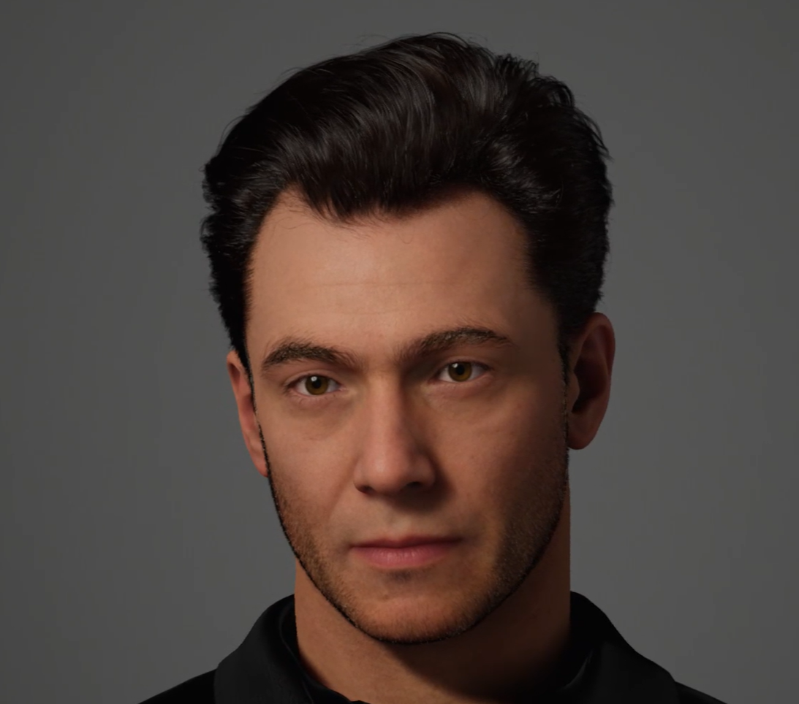
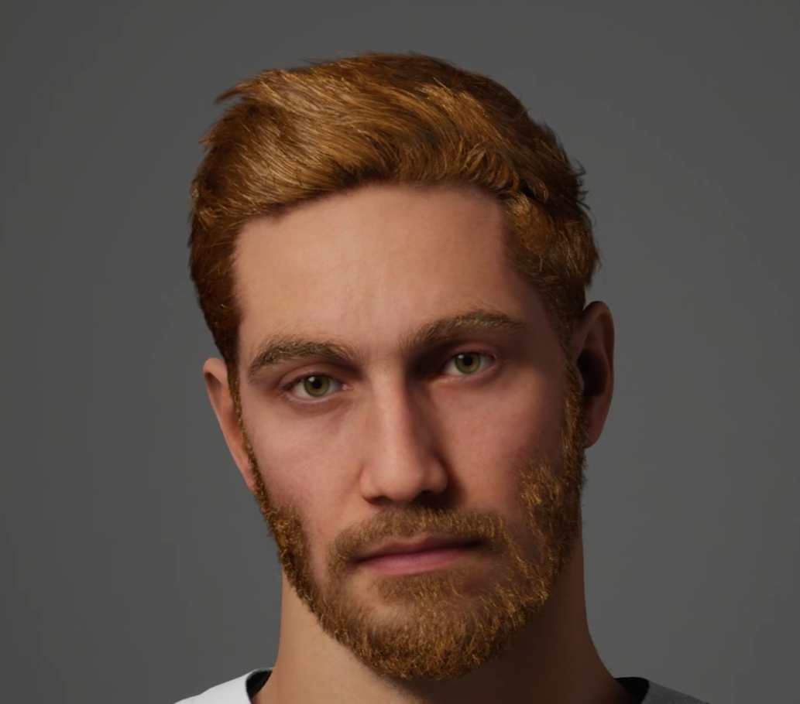

# Methodology

The current project will employ quantitative approach to investigate face and body perception during social interactions to assess socially anxious people. The research will analyse the neural and behavioural activities of non-clinical participants who have high levels of social anxiety to a variety of social interactions through EEG measurements and participants’ behavioural responses. Participants will engage in social interactions in a controlled VR setting. The VR setting will be developed to create realistic social interactions. There will be 24 young to middle-aged avatars. Gender of the avatars will be male. Metahumans will be used to create realistic avatars. Each experimental trial will randomly show one avatar. VR setting will be designed to resemble a typical office environment that may evoke anxiety among participants. Participants will be in an office space including some furniture and space for movement.

 

There will be a total of 240 trials in this experiment. There are three emotional valence conditions in the experiment, and each condition will have 80 trials.For each emotional valence condition, 8 virtual characters will be randomly selected, and each of them will be shown 10 times.Three different emotional valence conditions will be created for each of the 24 virtual characters, and no participant will see the same virtual character with different emotional valence. Each virtual character will have consistent emotional valence throughout the experiment for each participant.

The Unreal game engine will be used to create a VR scenario for social interaction.  When the participants put on the HTC Vive VR headset, at the beginning of the experiment, the lighting in the VR setting will be off.  There will be “x” symbol in the centre of the dark space which points between the avatar’s eyes and there will be “O” symbol which points where the participant’s head is pointing towards. Participant will be asked to look ahead to align the “X” and “O” symbols. And then, lights will be turned on. The lighting-on moment marks the stimulus onset. This method ensures strong visual onsets for evoking strong ERP responses (Djebbara el al., 2019).
 
The HTC Vive VR headset and the etee VR handsets, which designed for enhance finger, gesture tracking, and pressure sensing capabilities for a more immersive VR environment, will be used during the experiment.  In the current research, the aim is to use the etee handsets to provide tactile feedback and sensing. Additionally, people use their hands to gesture, feel and interact and since the sensation of touch, such as a handshake, is an integral part of human interaction (Buckingham, 2021), replicating handshake in a VR setting can positively influence the immersion of the experiment for participants. Most of the previous tactile research involves the emotional response of the participants to the tactile feedback. Current research will use tactile feedback to increase the immersion in VR setting. Furthermore, tactile-sensing yoga mattress will be used to track participants foot pressure to examine their approach or withdraw attitudes during the social interaction.
 
For the EEG measurements a mobile EEG system (ANT Neuro EegoSports) will be used to gather data. EEG data will be acquired through 32 channels. Lab-streaming-layer (LSL) will be used for sending triggers to mark the onsets of the stimuli and for synchronizing data streams of different recordings and other physiological measures as part of the mobile EEG system such as electrocardiogram (ECG) and galvanic skin response (GSR). ERP components of N170 and P1 will mainly be analysed. P2 and P3 components of ERPs and frontal alpha asymmetry will be analysed to complement other results. Frontal alpha symmetry is the distinction in alpha activity between the left and right frontal lobes of the brain as observed in EEG recording (Ahern & Schwartz, 1985; Davidson et al., 1985). Asymmetrical activity in the right and left hemispheres of the brain indicates an individual’s tendency to display specific types of emotional responses such as positive or negative, and motivational responses such as approach related or withdrawal related attitudes (Smith et al., 2017) . Higher activation in the right frontal lobe is associated with withdrawal related attitudes, while higher activation in the left frontal lobe is associated with approach related attitudes (Davidson et al., 1982). This measure will confirm participants’ attitudes in the VR-based social interactions.
 
State and trait anxiety will be measured at the beginning of each experiment and during the experiment. For the state anxiety, heart rate (from the ECG data) and GSR will be measured. For the measurement of trait social anxiety, self-reported Liebowitz Social Anxiety Scale (LSAS) will be used to assess fear and avoidance associated with social interactions (Liebowitz, 1987). In addition to that, Social Interaction Anxiety Scale (SIAS) will be used to assess general fears of social interaction situations (Mattick & Clarke, 1988).  According to the scores of the participants, they will be categorized according to their level of social anxiety.
 
Participants for the present project will be selected from amongst Bournemouth University students based on LSAS scores. The threshold score will be 30 (Mennin et al., 2002). According to the epidemiological studies, SAD is more prevalent among females across all ages (Wittchen et al., 1999; Fehm., 2005; Furmark et al., 2002) and it is easier to recruit female participants from the Psychology Department. Therefore, the project will only test female participants. 60 participants will be recruited for Experiments 1 and 2; and 40 participants will be recruited for Experiment 3. After examining the results of Experiments 1 and 2, depending on the results of the research, SAD patients may be recruited for Experiment 3 via the NHS.

